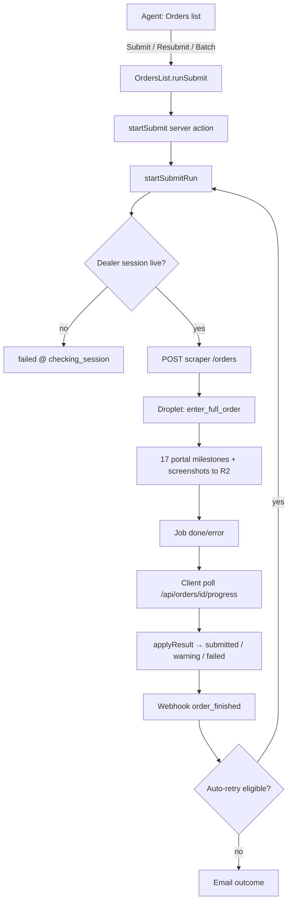
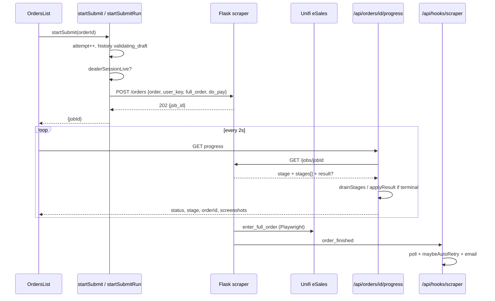
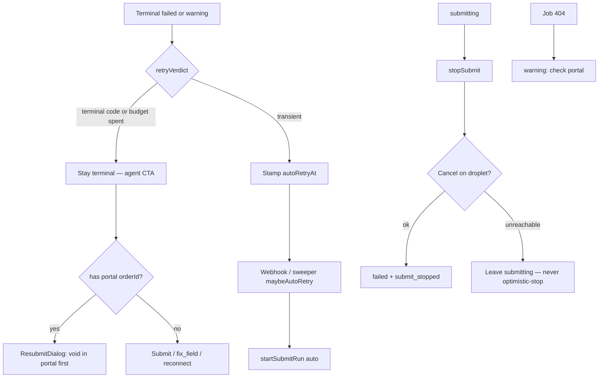

# Order Entry — Submission Workflow Map

**Captured:** 2026-09-10 on production (`https://bizzflow.top`)  
**Walked as:** `aiboot1@gmailcom` (louis / AIB001)  
**Dealer session:** TMRS00517 (already connected; ~60 min countdown)  
**Clone source:** ORD-0104 → `?clone=cmtppq3ua000004l9ihgeahc7`  
**Detail evidence:** `/order-entry/orders/cmtppq3ua000004l9ihgeahc7` (Submitted, 17/17, 8m 21s, 21 portal captures)

This document maps **how order submission actually works today** — UI → BizzFlow server → scraper droplet → Unifi portal — with live snapshots at each agent-facing step. It is a diagnosis aid for a buggy flow, not a how-to for minting new Unifi orders.

> **Safety:** A successful submit mints a **real, chargeable** Unifi order. This walkthrough cloned and inspected history; it did **not** click Submit on the cloned draft.

Snapshots live in [`snapshots/`](./snapshots/).

---

## 0. Credentials (project memory)

| System | Login |
| --- | --- |
| BizzFlow app | Email `aiboot1@gmailcom` (**no dot** in `gmailcom` — `aiboot1@gmail.com` is rejected). Password is the team-known `aiboot1` credential. |
| Unifi dealer (Order Entry connect) | Staff `TMRS00517` / password team-known / registered email `nexion.eform@gmail.com` |

HTML5 `type="email"` on the sign-in form rejects `aiboot1@gmailcom` in some browsers until the input type is loosened — agents hit this constantly.

---

## 1. Big picture



**Architecture one-liner:** the browser starts a job and polls; the **webhook** owns email + auto-retry; **`applyResult`** (`src/lib/order-submit.ts`) is the single final-state authority.

`OrderForm` only **saves** drafts. Portal submit always starts from the **Orders** list (`/dashboard/order-entry/drafts`).

---

## 2. Agent-facing UI flow (with snapshots)

### Step A — Sign in


→ Dashboard after login:


### Step B — Open Order Entry

URL: `/dashboard/order-entry` → usually lands on **New Order**.  
Header shows dealer connection: **Connected as TMRS00517** + countdown + Disconnect.


Tabs (note route quirk):

| Label | Route |
| --- | --- |
| New Order | `/dashboard/order-entry/new-order` |
| **Orders** | `/dashboard/order-entry/drafts` ← list of **all** statuses; route kept as `/drafts` for bookmarks |
| Plan Settings | `/dashboard/order-entry/plan-details` |

### Step C — Orders list (submit surface)


What you see per row:

- Status badge (`Submitted`, `Cancelled`, `Draft`, `Failed`, `Warning`, `Submitting`, …)
- Primary action: **Submit** / **Resubmit** (gated by `canSubmit` / `canResubmit` in `src/lib/order-types.ts`)
- `⋯` menu: Details, Edit draft, **Clone to new draft**, Cancel / Stop / Delete (status-dependent)

### Step D — Clone an existing order


Click **Clone to new draft** →

`/dashboard/order-entry/new-order?clone=<cuid>`

**Copied** (see `src/lib/clone-order.ts`): customer, contact, address (+ `addressId`), package, device, remarks, appointment lead hours.  
**Never copied:** status, attempts, portal order no., errors, job/stage, **documents**, identity ids.


**Observed:** Save is blocked until MyKad (+ supporting docs) are attached — footer shows “Documents 2” / red “cannot be saved until this is attached”. Clone therefore cannot be submitted until docs are re-uploaded (by design: R2 key collision risk if docs were shared).

### Step E — Save draft → Submit from list

```
Clone → fill docs → Save Order → lands on Orders list as Draft
  → row primary button "Submit"
  → optimistic status=submitting, row expands SubmitProgress checklist
  → startSubmit → poll /api/orders/:id/progress every 2s
  → toast on terminal status
```

**This walkthrough did not press Submit** (real portal mint).

### Step F — Order detail / history (evidence of a real run)

Details opens in a **new tab**: `/order-entry/orders/<cuid>` (not the ORD-xxxx reference).


Tabs: **Progress** (17-step checklist) · **History** (timeline + 21 captures) · **Details** (field dump).

#### Progress checklist (the live submit UI)


Divider after step **08 Capturing order number** = **point of no return** (`POINT_OF_NO_RETURN`): portal has minted a real order id. Failures after this must **not** naive-retry.

#### Portal captures (what the scraper photographed)


History timeline (excerpt):


---

## 3. The 17 submit stages (agent checklist ↔ scraper)

From `SUBMIT_STEPS` in `src/lib/order-types.ts`, verified against ORD-0104 History:

| # | Key | UI label | What happens (ORD-0104 timing) |
| --- | --- | --- | --- |
| 01 | `validating_draft` | Checking draft | BizzFlow history stamp “Submit started” (05:50:33) |
| 02 | `checking_session` | Verifying dealer session | Server-side expiry check before POST `/orders` |
| 03 | `creating_customer` | Creating customer profile | Portal personal customer create/reuse (+42s) |
| 04 | `checking_address` | Checking installation address | Feasibility By Address (+17s) |
| 05 | `checking_plan` | Checking package availability | Offer grid match (+44s) |
| 06 | `placing_order` | Placing order | Click Order / implied by plan |
| 07 | `attaching_customer` | Attaching customer | Attach customer to order |
| 08 | **`capturing_order_no`** | **Capturing order number** | **Mint** `2609000124252774` — **point of no return** |
| 09 | `installation_contact` | Setting installation contact | New Connection page 1 |
| 10 | `billing_account` | Setting billing account | Account pick |
| 11 | `winback_tagging` | Winback tagging | e.g. HSBA Wireless Access |
| 12 | `selecting_device` | Selecting device | Subproduct / device (may substitute) |
| 13 | `uploading_attachments` | Uploading documents | Attachments tab |
| 14 | `appointment` | Booking appointment | Calendar slot |
| 15 | `delivery_terms` | Delivery details | Delivery + T&C |
| 16 | `pay` | Payment | Pay gate / click |
| 17 | `submitted` | Submitted | Confirmation + e-RF fold-in |

**Non-checklist capture slots** (History only): Offer grid, New Connection page 1, Broadband/Voice/TV tabs, Attachments, Install Information, Device List, Fee Preview, Order Item List, Appointment calendar, Pay screen, Order confirmation, e-RF PDF, …

Screenshot R2 key pattern:

```
order-screenshots/<userId>/<orderId>/submit-<attempt>-<slot>.jpg
```

---

## 4. Server / droplet sequence (technical)



### Key files

| Area | Path |
| --- | --- |
| UI orchestrator | `src/components/order-entry/OrdersList.tsx` |
| Row actions | `src/components/order-entry/OrderRow.tsx` |
| Progress checklist | `src/components/order-entry/SubmitProgress.tsx` |
| Clone field contract | `src/lib/clone-order.ts` |
| Start handoff | `src/lib/order-start.ts` |
| Finalize / poll | `src/lib/order-submit.ts` (`applyResult`) |
| Retry policy | `src/lib/retry-policy.ts`, `src/lib/order-retry.ts` |
| Flask API | `scraper/api_server.py` |
| Portal runner | `scraper/oe_feasibility.py` (`enter_full_order`) |

### Status model

| Status | Meaning |
| --- | --- |
| `draft` | Editable; not (yet) a numbered portal order |
| `submitting` | Job in flight |
| `submitted` | Success **with** `erf_key` (e-RF in R2) |
| `warning` | Partial / check portal / missing e-RF / lost job after droplet restart |
| `failed` | Safe to treat as “no mint” (or `submit_stopped`) |
| `cancelled` | BizzFlow bookkeeping only — **does not void Unifi** |

**Critical `applyResult` rules:**

- Error **with** portal `order_id` → `warning` (never plain `failed` that re-enables naive Submit).
- Success without `erf_key` → `warning` + `erf_not_downloaded`.
- Job 404 after droplet restart → `warning` (“check portal”) — duplicate risk.

### Batch path

Select `canSubmit` rows → `BatchSubmitDialog` → `startBatchSubmit` → `POST /orders/batch` → droplet runs **one member at a time** → `batch_finished` webhook → email → `retryFailedMembers`. Closing the tab does **not** stop the batch.

### Auto-retry

Budget: **3** auto retries per manual submit (hard cap **20** attempts). Busy (409/503) defers ~2 min without burning budget. Terminal error codes (blacklist, PII OTP, address no-service, `submit_stopped`, …) never auto-retry.

---

## 5. ORD-0104 — real run timeline (evidence)

| Time | Stage | Detail |
| --- | --- | --- |
| 05:50:33 | Checking draft | Submit started |
| 05:51:15 | Creating customer | +42s |
| 05:51:32 | Checking address | Eco Majestic unit |
| 05:52:16 | Checking plan | Unifi Home 1Gbps Premium Value MAX With Device (36M) |
| 05:52:20 | Placing order / Offer grid | “Customer dialog already open” |
| 05:52:36 | **Capturing order no** | **2609000124252774** |
| 05:52:40–05:53:34 | Contact → account → winback → device | |
| 05:54:10–05:57:10 | Broadband / Voice / TV tabs + captures | |
| 05:57:10–05:57:57 | Docs → install → device list → fees → items | |
| 05:57:57–05:58:14 | Appointment → delivery | |
| 05:58:33 | Pay screen | |
| 05:58:42–05:58:54 | Submitted + confirmation + e-RF PDF | Advance Payment RM100 note |

**Elapsed:** 8m 21s · **Attempts:** 1 · **Captures:** 21

---

## 6. Bugs / fragile points observed or confirmed

1. **Submitted + red “failure” copy on the same Progress pane (ORD-0104)**  
   Status is green **Submitted** (17/17, e-RF present) but Progress still shows:
   - `Advance Payment RM100.00 was required.`
   - `Tell your admin: an unclassified failure on ORD-0104.`  
   Root cause in code: `applyResult` **stores** the advance-payment sentence on `errorMessage` even for successful `submitted` (`order-submit.ts` ~387–388). UI treats a non-null `errorMessage` / missing `errorCode` like an unclassified failure. Agents read a successful paid order as broken.

2. **Clone cannot save without re-uploading documents** — intentional (R2 key collision), but easy to mistake for a save bug.

3. **Sign-in email `aiboot1@gmailcom`** fails HTML5 email validation in automation / some browsers; `aiboot1@gmail.com` is the wrong account for this user.

4. **Orders tab route is `/drafts`** — navigating to `/dashboard/order-entry/orders` 404s. Detail URLs use **cuid**, not `ORD-xxxx`.

5. **Point of no return at step 08** — any failure after mint needs portal void before Resubmit; otherwise duplicates.

6. **In-memory droplet job registry** — restart → job 404 → `warning` “check portal”.

7. **Single-browser capacity** — concurrent submits hit busy / deferred retry.

8. **Superadmin submit runs under the superadmin’s dealer session**, not the draft owner’s.

9. **`ORDER_ENTRY_DO_PAY`** — when false, completed runs become `warning` (`erf_not_downloaded`) by design; looks like failure to agents.

10. **Computer-use / overlay flakiness** on the `⋯` menu in some automation paths; Playwright with `getByRole('button', { name: /More actions/ })` is reliable.

---

## 7. Failure / retry / stop flowchart



---

## 8. How to re-walk this safely

1. Sign in as `aiboot1@gmailcom`.
2. Confirm dealer Connected as TMRS00517 (or reconnect with OTP to `nexion.eform@gmail.com`).
3. Open `/dashboard/order-entry/drafts`.
4. `⋯` → **Clone to new draft** on any row (e.g. ORD-0104).
5. Re-attach MyKad + supporting docs → Save.
6. To **inspect** submission without minting: open **Details** on a past Submitted/Warning/Failed order and read Progress + History captures.
7. To **test submit**: only against a deliberate test draft, then **void** the Unifi order — see `docs/Order Testing.md`.

Replay scripts (credentials redacted — fill locally):

- `scripts/capture-submit-workflow.mjs`
- `scripts/capture-submit-detail.mjs`

---

## 9. Snapshot index

| File | What |
| --- | --- |
| `01_signin.webp` / `07_signin_pw.png` | Sign-in |
| `08_after_login.png` | Dashboard |
| `03_order_entry_shell.webp` / `19_*.png` | OE shell + dealer connected |
| `09_orders_list.png` | Orders list |
| `10_row_menu_open.png` | ⋯ menu with Clone |
| `11–13_clone_form_*.png` | Cloned New Order (docs empty) |
| `22–25_*.png` | Detail Progress checklist |
| `26–32_*.png` | History + portal capture carousel |
| `27_portal_capture_1..4.png` | Offer grid → New Connection → … |

Artifact mirror: `/opt/cursor/artifacts/order-submit-workflow/`.
